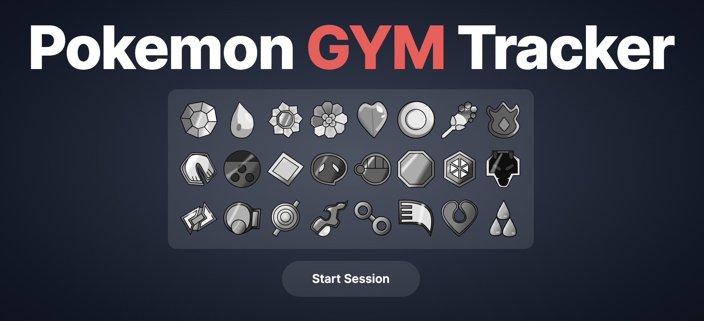
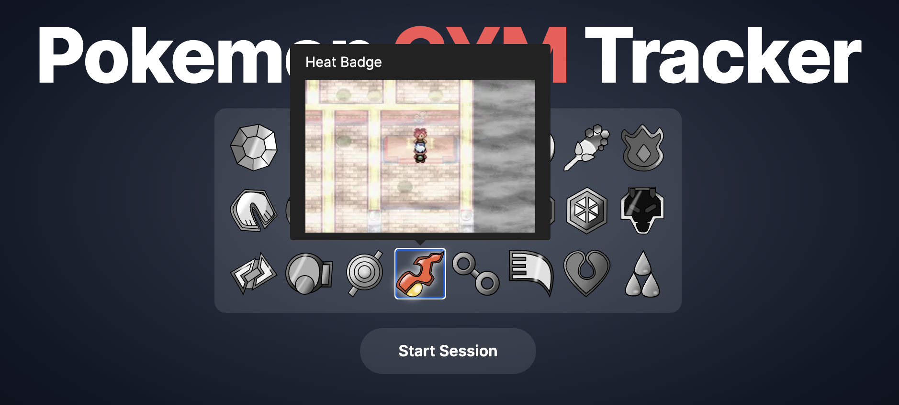
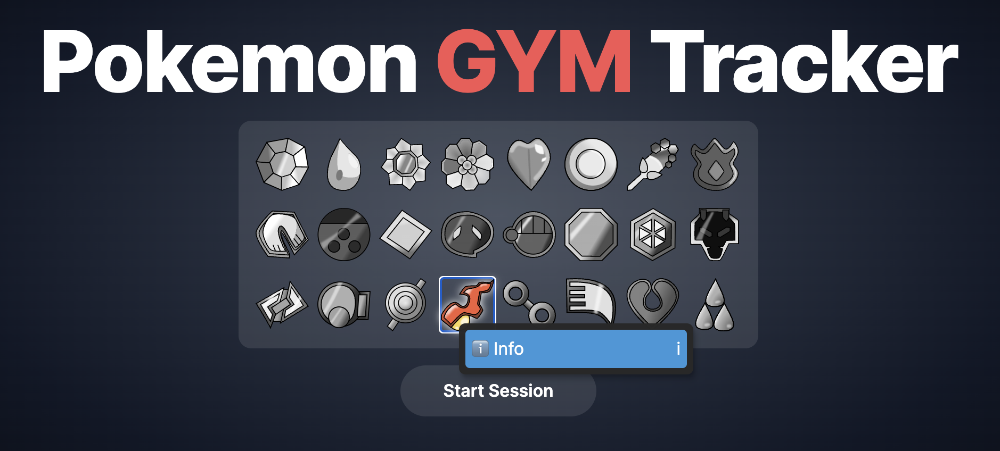
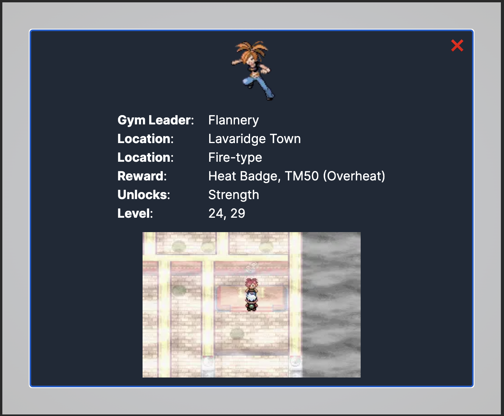
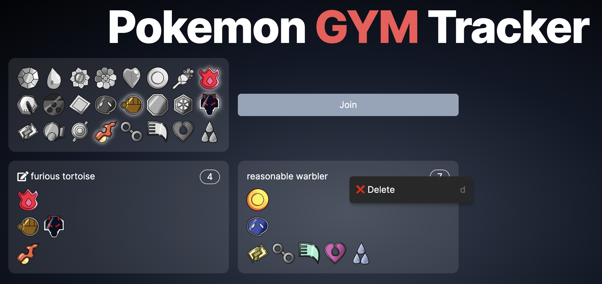

# pokemon-gym-tracker

> ℹ️ [Visit site](https://pokemon-gym-tracker.nikasol.xyz/)

This project is to track the badges on a randomize game of 3 pokemon games, all at the same time which are `Pokemon Fire Red`, `Crystal Dust` and `Emerald`.

> ℹ️ You can find how to play it here: [https://kittypboxx.github.io/GBAXG/](https://kittypboxx.github.io/GBAXG/)

## Why ?

You can play with friends and timebox your play session and as you win your gym badges mark them on the page (manually).

The reason for this is because the game does not track accurately all the badges across all 3 games.

## Features

### Hover

Some elements on the site provide information when you hover on them.

#### Badges shows you how the gym looks and name of the badge

### Modal Info

#### Some elements have a context menu that provides extra information when you right click on them

### Sessions

Here you can provide the link for your session to anyone to join. This will be updated on real-time.

> ℹ️ Session with two trainers

#### Session leader have special interaction with other trainers

> ℹ️ Session leader can delete other trainers

## Support

